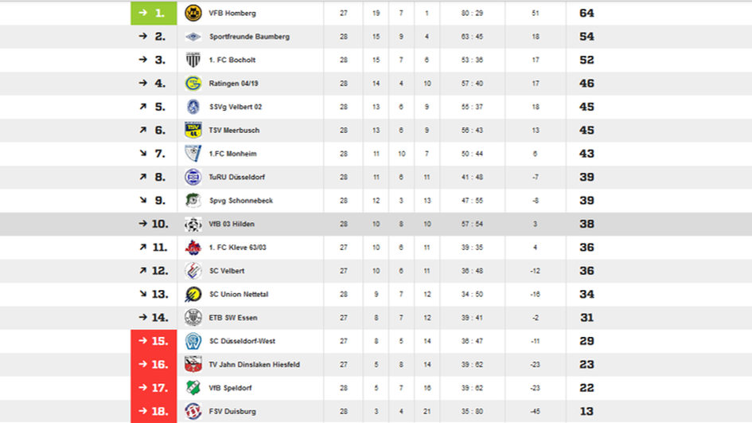

Pascal Weber behauptet den Ball im Hinspiel.  Foto: Köhlen, Stephan

Im Vergleich zum hart umkämpften 1:0 gegen den [SC Velbert](https://www.scvelbert.de/Senioren/1-Mannschaft/) vor wenigen Tagen auf heimischen Platz, wechselte Marc Bach im Vorfeld des richtungsweisenden Auswärtsspiels bei [SC Union Nettetal](http://www.fussball-nettetal.de/scu/teams/senioren/2016-11-03-14-41-01/news/) auf zwei Positionen. Während Timo Kunzl nach abgesessener Gelbsperre wieder in die Startaufstellung zurückkehrte, konnte auch Kapitän Stefan Schaumburg wieder von Beginn an mitwirken, nachdem beim Abschlusstraining noch ein Fragezeichen hinter seinem Einsatz gestanden hatte.
Trotz langer Anreise im Osterverkehr, waren die Gäste aus Hilden von der ersten Minute hellwach. So dauerte es nicht lange bis der wiedergenesene Stefan Schaumburg einen Freistoß aus vielversprechender Position über die Mauer hinweg in den linken Winkel schlenzte **(15.)**. Doch die Antwort der Hausherren kam prompt. Dominik Dohmen per Freistoß **(20.)** und René Jansen per Kopfball **(23.)** vergaben nur knapp. Nach Wiederanpfiff sahen die 100 Zuschauer an der Lobbericher Straße eine weitestegehend ausgeglichene Partie bei der sich gute Gelegenheiten für beide Mannschaften ergaben. So konnte Abwehrspieler Ogün Serdar in höchter Not einen Jansen-Schuss auf der Torlinie vereiteln, während der resultierende Konter über Timo Kunzl und Pascal Weber in di Geatano einen erfolgreichen Abnehmer fand **(60.)**. Den deutlichen Rückstand sah man den Nettetalern in der Folge an. Ihr Spiel wirkte farig, teilweise ideenlos und so nutzte Pascal Weber diese Situation eiskalt aus und verwertete eine Schaumburg-Flanke zum entscheidenden 0:3 **(63.)**. Als sich Routinier Naximilian Pohlig dann auch noch einen Aussetzer leistete und daraufhin mit der gelb-rote Karte das Spielfeld verlassen musste, war der rabenschwarze Tag für die Hausherren endgültig besiegelt. Es sollte allerdings noch nicht das Ende gewesen sein, als die Hildener in Überzahl auf ein weiteres Tor drängten. Und so fand eine vielversprechende Flanke des Kapitäns Stefan Schaumburg in der Mitte den Nettetaler Nico Drummer, der mit seinem Eigentor den 0:4 Endstand **(83.)** besiegelte.

Nach dem Spiel war die Erleichterung in den Worten des Cheftrainers Marc Bach deutlich zu hören: *"Der Sieg hat uns auf jeden Fall ganz gut getan".* Und so belegt der [Vfb 03 Hilden](http://www.vfb-hilden.de/seite/209719/1.-mannschaft.html/) nun Rang 10 in der Tabelle und geht in die letzten sechs Saisonspiele mit einem Punktevorsprung von neun Punkten auf den ersten Abstiegskandidaten SC West. Auch wenn das Saisonziel Klassenerhalt durch zuletzt 13 Punkten aus den vergangenen fünf Spielen zum Greifen nah erscheint, warnt Marc Bach noch vor zu viel Euphorie: *"In den letzten sechs Spielen brauchen wir vermutlich noch einen Sieg."* Am Sonntag in einer Woche geht es dann auf eigener Spielstätte gegen den Tabellenersten VfB Homberg, gegen die man sich im Hinspiel mit einem Punktgewinn bereits Respekt verschaffen konnte.

Von Moritz Bausch

Der Vfb 03 Hilden hat sich in das Tabellenmittelfeld gearbeitet Grafik: http://www.fussball.de