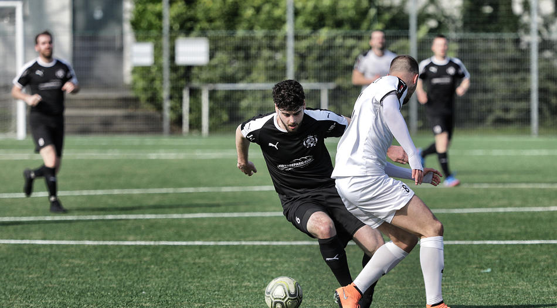

Talha Demir im Hinspiel gegen den SC Velbert. Foto: Köhlen, Stephan

Der [Vfb 03 Hilden](http://www.vfb-hilden.de/seite/209719/1.-mannschaft.html/) möchte seine Siegesserie am kommenden Sonntag im eigenen Stadion fortsetzen. Dabei wissen sie,dass das Spiel gegen die Mannschaft des [SC Velbert](https://www.scvelbert.de/Senioren/1-Mannschaft/) kein Selbstläufer wird, die besonders durch zwei Aktuere hervorsticht. *„Velbert ist eine hart zu spielende Nuss, hat mit Robin Hilger einen starken Torjäger und mit Pier Schulz einen hervorragenden Sechser“*, so der Cheftrainer der Hildener Marc Bach und ergänzt: *„Das ist eine machbare Aufgabe, aber sie ist brutal wichtig, deshalb müssen wir zu hundert Prozent unseren Fokus darauf legen.“*

Bereits im Hinspiel in Velbert taten sich die Hildener über die volle Spielzeit enorm schwer, was sicherlich schon mit dem frühen Rückstand **(4.)** zusammenhing. Erst in der Nachspielzeit der zweiten Halbzeit verwandelte Talha Demir einen berechtigten Foul-Elfmeter zum 1:1 Endergebnis **(94.)**, welches Marc Bach mehr als berechtigt fand: *„Am Ende war das Unentschieden sicher glücklich, aber auch hochverdient. Wir waren über 90 Minuten klar besser, haben uns viele Chancen erarbeitet.“*

Von Moritz Bausch