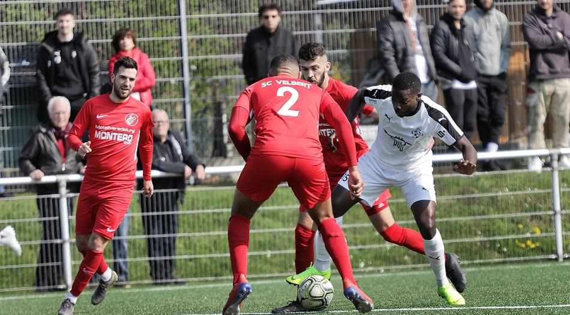

Der wiedergenesene Hildener Erwin Mambasa am Ball.  Foto: Köhlen, Stephan

Durch ein knappes 1:0 auf der heimischen Sportanlage an der Hoffeldstraße rücken der [Vfb 03 Hilden](http://www.vfb-hilden.de/seite/209719/1.-mannschaft.html/) diese Saison erstmals auf Rang 10 der Tabelle vor. Dabei bleibt der Abstand auf die Abstiegsplätze mit nun sechs Zählern jedoch weiterhin klein, was Cheftrainer Marc Bach dem Spiel jedoch nicht von seiner positiven Einstellung abbrachte: *„Wir konnten unsere Serie auf zehn Punkte in vier Spielen ausbauen“.* Auch wenn die Partie über weite Strecken an Qualität vermissen ließ resümmierte er: *„In Summe war unser Sieg verdient“.*

Während Marc Bach für die Partie aus dem Vollen schöpfen und seine beste Startelf aufstelle konnte, musste auf der anderen Seite der Cheftrainer des [SC Velbert](https://www.scvelbert.de/Senioren/1-Mannschaft/) Ralf vom Dorp auf zahlreiche Oberligaspieler verletzungsbedingt verzichten. In der Folge stellte er seine Mannschaft sehr defensiv ein, die er noch mit talentierten Spielern  der eigenen zweiten Mannschaft, sowie der A-Junioren Mannschaft ergänzte.

Das Spiel ließ lange Zeit an Qualiät vermissen. Während sich der [Vfb 03 Hilden](http://www.vfb-hilden.de/seite/209719/1.-mannschaft.html/) gegen tief stehende Velberter sichtlich schwer tat, stellten diese ihre Offensivbemühungen von Anfang an ein und konzentrierten sich ausschließlich auf die Verteidigung. Und so ging es nach den ersten 45 Minuten ohne nennenswerte Torraumszenen in die Pause. Nach der Pause erhöhten die Hildener ihren Einsatz und kamen zu ersten Torabschlüssen, welche allerdings noch für keine große Gefahr im Tor von Velberts Schlussmann Peter-Richard Garweg sorgten. Mitten in der Drangphase der Hildener sah Verteidiger Talha Demir dann die gelb-rote Karte wegen überharten Einsteigens **(60.)**, nachdem er bereits in der ersten Halbzeit wegen Foulspiels gelb sah. Ungeirrt dessen, spielten die Hildener weiterhin mutig nach vorne und so belohnte Zissis Alexandris seine Mannschaft nach Hereingabe von Patrick Percoco zum 1:0 **(83.)**, was gleichzeitig den Endstand markierte.

Bereits am Gründonnerstag erwartet die Hildener das nächste Saisonspiel bei dem [SC Union Nettetal](http://www.fussball-nettetal.de/scu/teams/senioren/2016-11-03-14-41-01/news/).

Von Moritz Bausch